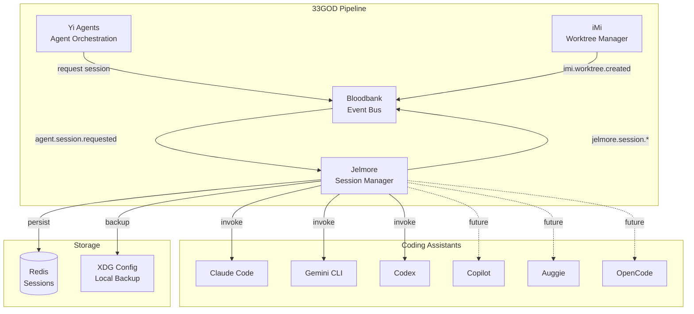

# Jelmore - GOD Document

> **Guaranteed Organizational Document** - Developer-facing reference for Jelmore
>
> **Last Updated**: 2026-02-02
> **Domain**: Workspace Management / Development Tools (Shared)
> **Status**: Active (Development)

---

## Product Overview

**Jelmore** is an **event-driven orchestration layer for agentic coders**. It provides a unified CLI and API interface to programmatically manage sessions across multiple AI coding assistants (Claude Code, Codex, Gemini CLI, and more). Rather than invoking coding assistants directly, Jelmore abstracts provider-specific details behind a consistent command and event model, enabling automated workflows, session persistence, and cross-provider observability.

**Key Capabilities:**
- **Unified Provider Interface**: Single CLI/API to orchestrate Claude Code, Codex, Gemini CLI, and future assistants
- **Event-Driven Integration**: Consumes `agent.session.requested` events and emits session lifecycle events to Bloodbank
- **Session Management**: Continue/resume semantics with Redis-backed persistence and correlation ID tracing
- **Command Pattern Architecture**: Chainable commands with pre/post hooks for extensibility
- **Cross-Provider Search**: Query session history across all supported coding assistants

**Why Jelmore Exists:**

In the 33GOD ecosystem, AI agents need programmatic control over coding assistants. Manual CLI invocation lacks:
1. Event emission for observability
2. Unified session management across providers
3. Integration with Bloodbank for automated workflows

Jelmore bridges this gap by acting as a session orchestrator that both humans and Yi agents can use to spawn, monitor, and search coding sessions.

---

## Architecture Position



**Role in Pipeline**: Jelmore sits between the Agent Orchestration domain and actual coding assistants. When a Yi agent needs to perform coding tasks, it publishes an `agent.session.requested` event. Jelmore consumes this event, spawns the appropriate coding assistant, manages the session lifecycle, and emits events for observability.

**Dual Domain Membership:**
- **Workspace Management**: Manages execution context for coding sessions, integrates with iMi worktrees
- **Development Tools**: Provides programmatic access to AI coding assistants as a meta-tool

---

## Event Contracts

### Bloodbank Events Emitted

| Event Name | Routing Key | Payload Schema | Trigger Condition |
|------------|-------------|----------------|-------------------|
| `jelmore.session.started` | `jelmore.session.started` | `SessionStartedPayload` | Session successfully initialized |
| `jelmore.session.completed` | `jelmore.session.completed` | `SessionCompletedPayload` | Session terminates (success or failure) |
| `jelmore.session.paused` | `jelmore.session.paused` | `SessionPausedPayload` | Session paused (explicit pause or timeout) |
| `jelmore.session.resumed` | `jelmore.session.resumed` | `SessionResumedPayload` | Paused session resumes execution |
| `jelmore.command.executed` | `jelmore.command.executed` | `CommandExecutedPayload` | Command completes (success or retry exhausted) |
| `jelmore.command.failed` | `jelmore.command.failed` | `CommandFailedPayload` | Command fails after all retries (routes to DLQ) |

**Event Payload Examples:**

```json
// jelmore.session.started
{
  "session_id": "550e8400-e29b-41d4-a716-446655440000",
  "provider": "claude",
  "correlation_id": "req-abc123",
  "worktree_path": "/home/user/33GOD/feat-auth",
  "agent_id": "yi-agent-001",
  "started_at": "2026-02-02T10:00:00Z",
  "metadata": {
    "source": "bloodbank",
    "task": "Implement JWT middleware"
  }
}
```

```json
// jelmore.session.completed
{
  "session_id": "550e8400-e29b-41d4-a716-446655440000",
  "provider": "claude",
  "correlation_id": "req-abc123",
  "duration_seconds": 1847,
  "prompt_count": 12,
  "success": true,
  "completed_at": "2026-02-02T10:30:47Z",
  "summary": "Implemented JWT authentication middleware with refresh token support"
}
```

### Bloodbank Events Consumed

| Event Name | Routing Key | Handler | Purpose |
|------------|-------------|---------|---------|
| `agent.session.requested` | `agent.session.#` | `AgentPromptListener.handle()` | Spawn coding session for agent |
| `imi.worktree.created` | `imi.worktree.created` | `WorktreeHandler.on_created()` | Associate sessions with worktrees |
| `imi.worktree.released` | `imi.worktree.released` | `WorktreeHandler.on_released()` | Cleanup sessions for released worktrees |

**Consumed Event Payload:**

```json
// agent.session.requested
{
  "provider": "claude",
  "prompt": "Implement user authentication with JWT",
  "session_id": null,
  "continuation_mode": "new",
  "hooks": [
    {"name": "auth", "enabled": true, "priority": 10}
  ],
  "metadata": {
    "agent_id": "yi-agent-001",
    "worktree_path": "/home/user/33GOD/feat-auth"
  },
  "correlation_id": "req-abc123"
}
```

---

## Non-Event Interfaces

### CLI Interface

```bash
# Launch provider session
jelmore start <provider> [options]
  --prompt TEXT          Initial prompt to send
  --session-id TEXT      Resume specific session by ID
  --continue             Continue most recent session for provider
  --config FILE          Use custom config file

# Examples
jelmore start claude --prompt "Write a fibonacci function"
jelmore start gemini --continue
jelmore start codex --session-id 550e8400-e29b-41d4-a716-446655440000

# Session management
jelmore sessions list [provider]
  --limit INT            Number of sessions to show (default: 10)
  --format [table|json]  Output format

jelmore sessions search <query>
  --provider TEXT        Filter by provider
  --date-range TEXT      Filter by date range (e.g., "7d", "2026-01-01:2026-02-01")

jelmore sessions resume <session-id>

# Configuration
jelmore config show
jelmore config set <key> <value>
jelmore config validate

# Event-driven mode (daemon)
jelmore listen
  --queue TEXT           Bloodbank queue name (default: agent.prompt)
  --workers INT          Number of worker threads (default: 5)

# Version
jelmore version
```

**Command Reference:**

| Command | Description | Example |
|---------|-------------|---------|
| `start <provider>` | Start new session or continue/resume | `jelmore start claude --prompt "Fix bug"` |
| `sessions list` | List sessions for provider | `jelmore sessions list claude --limit 5` |
| `sessions search` | Search across all sessions | `jelmore sessions search "authentication"` |
| `sessions resume` | Resume specific session | `jelmore sessions resume abc123` |
| `config show` | Display current configuration | `jelmore config show` |
| `config set` | Update configuration value | `jelmore config set provider.timeout 600` |
| `config validate` | Validate configuration file | `jelmore config validate` |
| `listen` | Start Bloodbank listener daemon | `jelmore listen --workers 3` |

### REST API Interface

**Base URL**: `http://localhost:8000`

**Endpoints:**

| Method | Endpoint | Description |
|--------|----------|-------------|
| `POST` | `/sessions` | Create new session |
| `GET` | `/sessions` | List all sessions |
| `GET` | `/sessions/{id}` | Get session details |
| `POST` | `/sessions/{id}/pause` | Pause active session |
| `POST` | `/sessions/{id}/resume` | Resume paused session |
| `DELETE` | `/sessions/{id}` | Terminate session |
| `GET` | `/sessions/search` | Search sessions |
| `GET` | `/health` | Health check |
| `GET` | `/providers` | List available providers |

**API Examples:**

```bash
# Create session
curl -X POST http://localhost:8000/sessions \
  -H "Content-Type: application/json" \
  -d '{
    "assistant_type": "claude",
    "worktree_path": "/home/user/33GOD/feat-auth",
    "task": "Implement JWT authentication",
    "agent_id": "yi-agent-001"
  }'

# List sessions
curl http://localhost:8000/sessions?provider=claude&limit=10

# Get session status
curl http://localhost:8000/sessions/550e8400-e29b-41d4-a716-446655440000

# Pause session
curl -X POST http://localhost:8000/sessions/550e8400-e29b-41d4-a716-446655440000/pause

# Resume session
curl -X POST http://localhost:8000/sessions/550e8400-e29b-41d4-a716-446655440000/resume

# Terminate session
curl -X DELETE http://localhost:8000/sessions/550e8400-e29b-41d4-a716-446655440000

# Search sessions
curl "http://localhost:8000/sessions/search?q=authentication&provider=claude"

# Health check
curl http://localhost:8000/health
```

---

## Technical Deep-Dive

### Technology Stack

- **Language**: Python 3.11+ (strict typing with mypy)
- **Package Manager**: uv
- **CLI Framework**: Typer + Rich (for formatted output)
- **Data Validation**: Pydantic v2 + pydantic-settings
- **Event Bus**: RabbitMQ via aio-pika (async) / pika (sync)
- **Session Storage**: Redis 7+
- **Retry Logic**: Tenacity (exponential backoff)
- **Logging**: structlog (structured JSON logging)
- **Testing**: pytest + pytest-asyncio + pytest-cov
- **Linting**: Ruff
- **Task Runner**: mise

### Architecture Pattern

Jelmore implements several Gang of Four patterns for extensibility and maintainability:

**1. Factory Pattern (Builder Selection)**

```
Input (provider name)
  ↓
CommandBuilderFactory.get_builder(provider)
  ↓
ClaudeCommandBuilder | GeminiCommandBuilder | CodexCommandBuilder
  ↓
Concrete Command Instance
```

The `CommandBuilderFactory` uses registration pattern to allow dynamic provider addition:

```python
# builders/factory.py
class CommandBuilderFactory:
    _builders: dict[str, type[CommandBuilder]] = {}

    @classmethod
    def register(cls, provider: str, builder_class: type[CommandBuilder]) -> None:
        cls._builders[provider.lower()] = builder_class

    @classmethod
    def get_builder(cls, provider: str) -> CommandBuilder:
        return cls._builders[provider.lower()]()
```

**2. Command Pattern (Encapsulated Invocations)**

Commands encapsulate provider invocations as objects, enabling chaining, hooks, and retry:

```python
# commands/base.py
class Command(ABC):
    def __init__(self) -> None:
        self._pre_hooks: list[Hook] = []
        self._post_hooks: list[Hook] = []

    @abstractmethod
    async def invoke(self, context: CommandContext) -> CommandResult:
        ...
```

**3. Chain of Responsibility (Hook System)**

Hooks implement cross-cutting concerns with priority-based ordering:

```python
# hooks/base.py
class Hook(ABC):
    def __init__(self, priority: int = 100) -> None:
        self._priority = priority

    @abstractmethod
    async def execute_pre(self, context: CommandContext) -> HookResult:
        ...

    @abstractmethod
    async def execute_post(self, context: CommandContext, result: CommandResult) -> HookResult:
        ...
```

**4. Strategy Pattern (Provider Adapters)**

Each provider implements a common interface:

```python
# providers/base.py
class Provider(ABC):
    @abstractmethod
    async def invoke(self, prompt: str, session_id: str | None = None, **kwargs) -> ProviderResponse:
        ...

    @abstractmethod
    async def health_check(self) -> bool:
        ...
```

### Component Structure

```
jelmore/
├── src/jelmore/
│   ├── __init__.py          # Package version
│   ├── cli/                  # CLI entrypoint (Typer commands)
│   │   ├── __init__.py
│   │   └── main.py          # Main CLI app with start, sessions, config, listen
│   ├── builders/             # Command builders (Factory pattern)
│   │   ├── __init__.py
│   │   ├── base.py          # Abstract CommandBuilder
│   │   └── factory.py       # CommandBuilderFactory (registration)
│   ├── commands/             # Command pattern implementation
│   │   ├── __init__.py
│   │   ├── base.py          # Abstract Command, CommandChain, CommandContext
│   │   └── (provider-specific commands)
│   ├── config/               # Configuration management
│   │   ├── __init__.py
│   │   └── settings.py      # Pydantic Settings with XDG support
│   ├── hooks/                # Pre/post execution hooks
│   │   ├── __init__.py
│   │   ├── base.py          # Abstract Hook, HookResult, HookPhase
│   │   └── (auth, logging, etc.)
│   ├── models/               # Pydantic models
│   │   ├── __init__.py
│   │   ├── commands.py      # AgentPromptPayload, CommandResult, SideEffect
│   │   └── sessions.py      # Session, SessionMetadata
│   └── providers/            # Provider-specific adapters
│       ├── __init__.py
│       ├── base.py          # Abstract Provider, ProviderConfig, ProviderResponse
│       └── (claude.py, gemini.py, codex.py)
├── tests/
│   ├── unit/                # Unit tests
│   ├── integration/         # Integration tests
│   └── conftest.py          # pytest fixtures
├── docker-compose.yml       # Redis + RabbitMQ for development
├── pyproject.toml           # Package definition
└── mise.toml                # Task runner configuration
```

### Execution Flow

```
Input (Bloodbank event or CLI)
  ↓
AgentPromptPayload (Pydantic validation)
  ↓
CommandBuilderFactory.get_builder(provider)
  ↓ (specialization based on provider)
ClaudeCommandBuilder | GeminiCommandBuilder | CodexCommandBuilder
  ↓ (with_hook, with_config)
Concrete Command Instance
  ↓ (hook attachment)
Pre/Post Hooks (auth, validation, logging)
  ↓ (optional chaining)
Ordered/Parallel Command Chain
  ↓
Executor
  ├─ Pre-hooks execute (abort if any return abort=True)
  ├─ Retry loop (3x, exponential backoff: 1s, 2s, 4s)
  │   └─ await cmd.invoke(context)
  ├─ Post-hooks execute
  ├─ Side Effect Queue (commands + responses)
  └─ On failure after retries → DLQ
  ↓
Side Effect Processing
  ├─ Command side effect → emit to Bloodbank (correlation_id)
  └─ Response side effect → package & fanout
  ↓
CommandResult (success, output, side_effects, execution_time_ms)
```

### Data Models

**Core Pydantic Models:**

```python
# AgentPromptPayload - Input for both CLI and events
class AgentPromptPayload(BaseModel):
    provider: str  # "claude", "gemini", "codex"
    prompt: str
    session_id: str | None = None
    continuation_mode: ContinuationMode = ContinuationMode.NEW
    hooks: list[HookConfig] | None = None
    metadata: dict[str, Any] = {}
    correlation_id: str = Field(default_factory=lambda: str(uuid4()))

# Session - Persistent session state
class Session(BaseModel):
    id: str
    provider: str
    created_at: datetime
    updated_at: datetime
    state: dict[str, Any]  # Provider-specific state
    metadata: SessionMetadata
    correlation_ids: list[str]  # For tracing command chains
    prompt_count: int = 0
    last_prompt: str | None = None
    last_response: str | None = None

# CommandResult - Output from command execution
class CommandResult(BaseModel):
    success: bool
    output: str | None = None
    error: str | None = None
    side_effects: list[SideEffect] = []
    execution_time_ms: float
    correlation_id: str
    session_id: str | None = None
```

**Continuation Modes:**

| Mode | Behavior |
|------|----------|
| `new` | Start fresh session |
| `continue` | Resume most recent session for provider |
| `resume` | Resume specific session by ID |

### Redis Schema

```
# Session storage
sessions:{provider}:{session_id} -> JSON(Session)
  TTL: configurable (default 24h)

# Indexing by provider
session:index:{provider} -> Sorted Set (score: timestamp, member: session_id)

# Full-text search tokens (inverted index)
session:search:tokens:{token} -> Set of session_ids

# Correlation ID tracing
correlation:{correlation_id} -> List of linked session/command IDs
```

### Configuration

Jelmore uses Pydantic Settings with XDG Base Directory compliance:

**Configuration File**: `~/.config/jelmore/config.yaml`

**Environment Variables** (JELMORE_* prefix):

| Variable | Default | Description |
|----------|---------|-------------|
| `JELMORE_DEBUG` | `false` | Enable debug mode |
| `JELMORE_ENVIRONMENT` | `development` | Environment (development/staging/production) |
| `JELMORE_REDIS_HOST` | `localhost` | Redis host |
| `JELMORE_REDIS_PORT` | `6379` | Redis port |
| `JELMORE_RABBITMQ_HOST` | `localhost` | RabbitMQ host |
| `JELMORE_RABBITMQ_PORT` | `5672` | RabbitMQ port |
| `JELMORE_PROVIDER_DEFAULT` | `claude` | Default provider |
| `JELMORE_PROVIDER_TIMEOUT_SECONDS` | `300` | Provider timeout |
| `JELMORE_LOG_LEVEL` | `INFO` | Log level |
| `JELMORE_LOG_FORMAT` | `json` | Log format (json/console) |
| `JELMORE_SESSION_TTL_HOURS` | `24` | Session TTL |

**Nested Configuration:**

```python
class JelmoreSettings(BaseSettings):
    debug: bool = False
    environment: str = "development"
    config_dir: Path = get_config_dir()  # ~/.config/jelmore
    data_dir: Path = get_data_dir()      # ~/.local/share/jelmore
    cache_dir: Path = get_cache_dir()    # ~/.cache/jelmore
    redis: RedisSettings
    rabbitmq: RabbitMQSettings
    provider: ProviderSettings
    logging: LoggingSettings
    session: SessionSettings
```

---

## Supported Coding Assistants

| Assistant | Provider Flag | CLI Tool | Status |
|-----------|---------------|----------|--------|
| Claude Code | `claude` | `claude` | Active |
| Gemini CLI | `gemini` | `gemini` | Active |
| Codex | `codex` | `codex` | Development |
| GitHub Copilot | `copilot` | `gh copilot` | Planned |
| Auggie | `auggie` | `auggie` | Planned |
| OpenCode | `opencode` | `opencode` | Planned |

**Adding a New Provider:**

1. Create provider adapter in `providers/{name}.py`:
```python
class NewProvider(Provider):
    async def invoke(self, prompt: str, session_id: str | None = None, **kwargs) -> ProviderResponse:
        # Provider-specific implementation
        ...

    async def health_check(self) -> bool:
        # Check if CLI is installed and configured
        ...
```

2. Create command builder in `builders/{name}_builder.py`:
```python
class NewProviderCommandBuilder(CommandBuilder):
    @property
    def provider(self) -> str:
        return "newprovider"

    def build(self, prompt: str, session_id: str | None = None) -> Command:
        # Build provider-specific command
        ...
```

3. Register in factory:
```python
CommandBuilderFactory.register("newprovider", NewProviderCommandBuilder)
```

4. Add configuration in `config/settings.py`:
```python
class ProviderSettings(BaseSettings):
    newprovider_api_key: str | None = Field(default=None, alias="NEWPROVIDER_API_KEY")
```

---

## Development

### Setup

```bash
# Clone and enter directory
cd /home/delorenj/code/33GOD/jelmore

# Install dependencies with uv
uv sync

# Start development services (Redis + RabbitMQ)
mise run docker:up

# Verify setup
mise run cli -- version
```

### Running Locally

```bash
# Start development environment
mise run dev

# Run the CLI
mise run cli -- --help
mise run cli -- start claude --prompt "Hello world"

# Or directly with uv
uv run jelmore --help
uv run jelmore start gemini --prompt "Write a test"
```

### Testing

```bash
# Run all tests
mise run test

# Run with coverage
mise run test:cov

# Run in watch mode
mise run test:watch

# Run specific test file
uv run pytest tests/unit/test_models.py -v
```

### Code Quality

```bash
# Run linting
mise run lint

# Fix linting issues
mise run lint:fix

# Run type checking
mise run typecheck

# Run all checks
mise run check
```

### Docker Services

```bash
# Start services
mise run docker:up

# Check status
mise run docker:status

# View logs
mise run docker:logs

# Stop services
mise run docker:down

# Reset (remove volumes)
mise run docker:reset
```

---

## Deployment

### Docker Compose (Development)

```yaml
version: "3.9"

services:
  redis:
    image: redis:7-alpine
    container_name: jelmore-redis
    ports:
      - "6379:6379"
    volumes:
      - redis-data:/data
    command: redis-server --appendonly yes
    healthcheck:
      test: ["CMD", "redis-cli", "ping"]

  rabbitmq:
    image: rabbitmq:3-management-alpine
    container_name: jelmore-rabbitmq
    ports:
      - "5672:5672"   # AMQP
      - "15672:15672" # Management UI
    environment:
      RABBITMQ_DEFAULT_USER: jelmore
      RABBITMQ_DEFAULT_PASS: jelmore_dev
      RABBITMQ_DEFAULT_VHOST: /jelmore
    healthcheck:
      test: ["CMD", "rabbitmq-diagnostics", "check_port_connectivity"]
```

### Production Considerations

- **Redis**: Use Redis Cluster or managed Redis (AWS ElastiCache, Redis Cloud)
- **RabbitMQ**: Connect to shared 33GOD Bloodbank instance
- **Secrets**: Use 1Password CLI (`op read`) for API keys
- **Logging**: Configure JSON format, forward to Candystore
- **Monitoring**: Healthcheck endpoint at `/health`

### Environment-Specific Configuration

```bash
# Development
JELMORE_ENVIRONMENT=development
JELMORE_DEBUG=true
JELMORE_LOG_FORMAT=console

# Production
JELMORE_ENVIRONMENT=production
JELMORE_DEBUG=false
JELMORE_LOG_FORMAT=json
JELMORE_REDIS_HOST=redis-cluster.internal
JELMORE_RABBITMQ_HOST=bloodbank.internal
```

---

## Resilience

### Retry Logic

Commands retry up to 3 times with exponential backoff:

| Attempt | Wait Time |
|---------|-----------|
| 1 | 1 second |
| 2 | 2 seconds |
| 3 | 4 seconds |

After all retries exhausted, failure routes to Dead Letter Queue (DLQ).

### Dead Letter Queue

Failed commands emit `jelmore.command.failed` with full context:

```json
{
  "correlation_id": "req-abc123",
  "provider": "claude",
  "prompt": "...",
  "error": "Provider timeout after 300s",
  "attempts": 3,
  "failed_at": "2026-02-02T10:05:00Z"
}
```

### Graceful Degradation

- **Redis unavailable**: Fail fast on startup (session storage required)
- **RabbitMQ unavailable**: CLI mode still works, event-driven mode fails fast
- **Provider unavailable**: Health check fails, command returns error

---

## Troubleshooting

### Common Issues

**1. "Unknown provider" error**

```bash
jelmore start myassistant
# Error: Unknown provider: myassistant. Available providers: claude, gemini, codex
```

Solution: Use supported provider name or register custom provider.

**2. Redis connection refused**

```bash
# Error: Could not connect to Redis at localhost:6379
```

Solution: Start Redis with `mise run docker:up` or configure remote Redis.

**3. Session not found**

```bash
jelmore sessions resume abc123
# Error: Session abc123 not found
```

Solution: Session may have expired (TTL). Check `JELMORE_SESSION_TTL_HOURS`.

**4. Provider timeout**

```bash
# Error: Provider timeout after 300s
```

Solution: Increase timeout with `JELMORE_PROVIDER_TIMEOUT_SECONDS=600`.

### Debug Mode

```bash
# Enable debug logging
JELMORE_DEBUG=true JELMORE_LOG_LEVEL=DEBUG jelmore start claude --prompt "test"

# Or in mise.toml
[env]
JELMORE_DEBUG = "true"
JELMORE_LOG_LEVEL = "DEBUG"
```

### Viewing Logs

```bash
# Console format (development)
JELMORE_LOG_FORMAT=console jelmore listen

# JSON format (production)
JELMORE_LOG_FORMAT=json jelmore listen | jq
```

---

## Integration with 33GOD Components

### iMi (Worktree Manager)

Jelmore integrates with iMi for workspace isolation:

```bash
# iMi creates worktree
imi add feat authentication

# Agent claims worktree
imi claim feat-authentication --agent-id yi-agent-001

# Jelmore session uses claimed worktree
jelmore start claude \
  --prompt "Implement authentication" \
  --worktree /home/user/.imi/workspaces/yi-agent-001/33god/feat-authentication
```

Event flow:
```
imi.worktree.created → Jelmore associates session
imi.worktree.released → Jelmore cleans up sessions
```

### Bloodbank

Jelmore is a first-class Bloodbank citizen:

- **Consumes**: `agent.session.requested` for programmatic session spawning
- **Emits**: `jelmore.session.*` for observability
- **Correlation**: All events carry `correlation_id` for distributed tracing

### Candystore

Session events persist to Candystore for analytics:

- Session duration statistics
- Provider usage patterns
- Error rate tracking
- Cross-provider comparisons

---

## Roadmap

### Current (v0.1.0)
- [x] Project structure and base abstractions
- [x] Pydantic models for commands and sessions
- [x] Command pattern with builder factory
- [x] Hook system foundation
- [x] Configuration with XDG support
- [ ] Complete Claude provider implementation
- [ ] Session persistence in Redis
- [ ] CLI commands (start, sessions, config)

### Next (v0.2.0)
- [ ] Bloodbank event listener
- [ ] Gemini provider
- [ ] Codex provider
- [ ] Cross-provider session search

### Future
- [ ] Additional providers (Copilot, Auggie, OpenCode)
- [ ] REST API with FastAPI
- [ ] Docker isolation per session
- [ ] Session streaming/real-time updates
- [ ] Semantic search with embeddings

---

## References

- **Domain Docs**:
  - `docs/domains/workspace-management/GOD.md`
  - `docs/domains/development-tools/GOD.md`
- **System Doc**: `docs/GOD.md`
- **Source**: `/home/delorenj/code/33GOD/jelmore/`
- **Tech Spec**: `docs/tech-spec-jelmore-2026-01-27.md`
- **Kickoff Notes**: `docs/kickoff.md`

---

## Appendix: Bloodbank Integration Details

For comprehensive Bloodbank integration documentation, see: `docs/BLOODBANK-INTEGRATION.md`

This covers:
- Hook execution flow for Claude Code events
- Session state management
- Event schemas for tool actions, session lifecycle
- Use cases (analytics, cost tracking, CI/CD triggers)
- Troubleshooting guide
